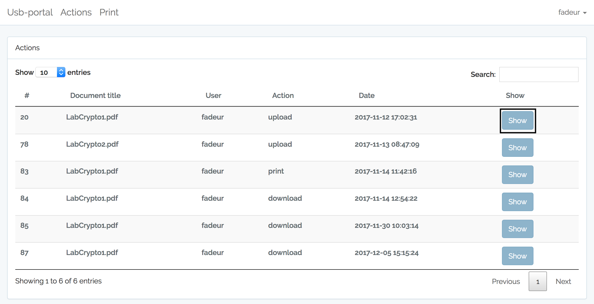
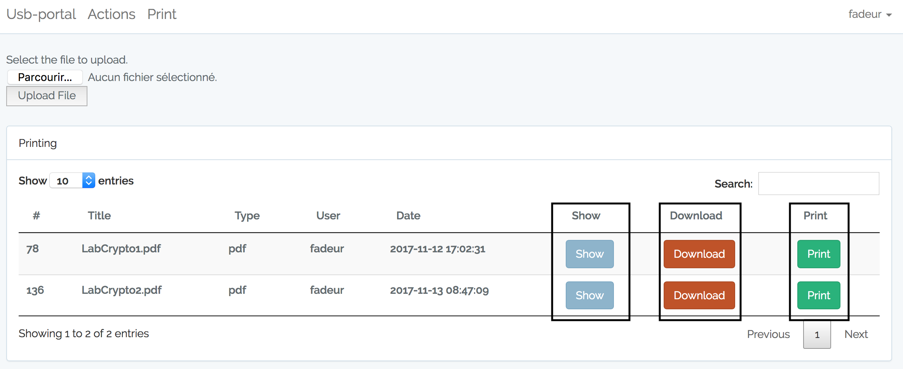

# usb-portal

[](https://travis-ci.org/RUCD/usb-portal)

The USB-Portal is a web interface that allows to:

* copy files to and from USB keys
* print PDF documents
* log user actions

It is meant to be used on secured networks where the administrator wants to keep track of user activity.

## Functionnalities

## USB


### History

In this view, you can check the activity of users.




### Print


To show all the actions that the users made, you have to click on the "Print" button on the top of the screen. 


When you are in the Print view, you can print, download and display a document.




It's possible to upload a file by cliclking on this button and when you have choose your file to upload, you have to click on the "Upload File" button.


To facilitate the user experience, it's possible to search, filter and sort in the table. 
Your research can be based on all table colunms. 
You can decide how many items you want to show per page thanks to the select in the left top of the screen.


## Installation

The USB-Portal is based on the Laravel framework.

```
git clone git@github.com:RUCD/usb-portal.git
cd usb-portal
cp env.travis .env
```

Modify ```.env``` to fit your needs

```
composer install
touch storage/app/db.sqlite
php artisan key:generate
php artisan migrate
```

## Contributing

### Development requirements

* vagrant
* node.js
* npm

### Building JS and CSS

The project uses laravel-mix and npm to build css and js files

https://laravel.com/docs/5.6/frontend

```
npm install
npm run dev
```

### Running the test environemnt

There is a vagrant VM for development. To launch the VM:

```
vagrant up
```

The app will be available at http://192.168.56.101

The Vagrant setup script creates a default user ```test : test```