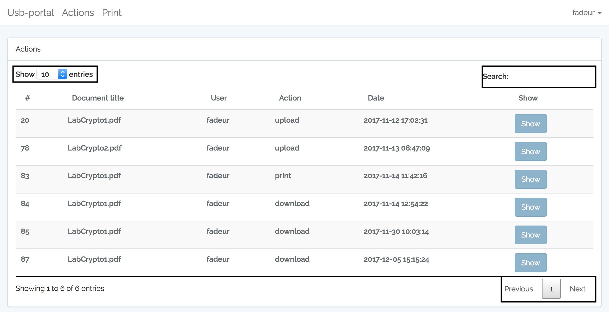
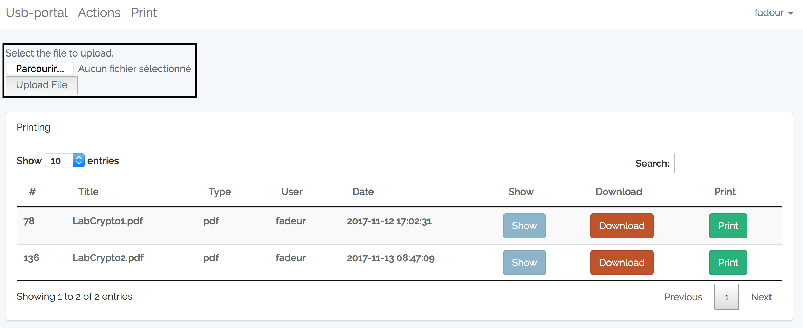
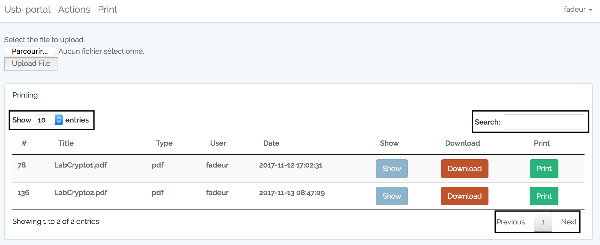

#usb-portal

[](https://travis-ci.org/RUCD/usb-portal)

## Functionnalities

### Action

```
To show all the actions that the users made, you have to click on the "Actions" button on the top of the screen.
```


```
In this view, you can check the action that people made on the files.   
```


```
To facilitate the user experience, it's possible to search, filter and sort in the table. 
Your research can be based on all table colunms. 
You can decide how many items you want to show per page thanks to the select in the left top of the screen. 
```


```
It's possible to see what the person checked by clicking on the button show   
```


### Print

```
To show all the actions that the users made, you have to click on the "Print" button on the top of the screen. 
```


```
When you are in the Print view, you can print, download and display a document. 
```


```
It's possible to upload a file by cliclking on this button and when you have choose your file to upload, you have to click on the "Upload File" button.
```


```
To facilitate the user experience, it's possible to search, filter and sort in the table. 
Your research can be based on all table colunms. 
You can decide how many items you want to show per page thanks to the select in the left top of the screen.
```
